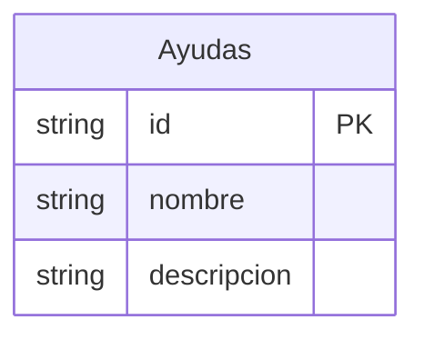

# Análisis de Requisitos - HU-CPA-0001_0011_0021

## 1. Portal CPA Virtual (sufijo CPA-VIRTUAL)

### a) Introducción
El aplicativo 'Portal CPA Virtual' tiene como objetivo...

### b) Desglose de historias, requisitos funcionales y no funcionales
- Historia 1: Descripción...
  - Requisitos funcionales: ...
  - Requisitos no funcionales: ...

### c) Casos de uso
- Caso de uso 1: Descripción...
  
### d) Criterios de aceptación
- Criterio 1: Descripción...

### e) Modelo de datos
- Tipos de contenido en Drupal: ...

### f) Diagrama entidad-relación (Mermaid)

## 2. CPA Virtual en su apartado de administración (sufijo CPA-VIRTUAL-ADMON)

### a) Introducción
El aplicativo 'CPA Virtual en su apartado de administración' tiene como objetivo...

### b) Desglose de historias, requisitos funcionales y no funcionales
- Historia 1: Descripción...
  - Requisitos funcionales: ...
  - Requisitos no funcionales: ...

### c) Casos de uso
- Caso de uso 1: Descripción...

### d) Criterios de aceptación
- Criterio 1: Descripción...

### e) Modelo de datos
- Tipos de contenido en Drupal: ...

### f) Diagrama entidad-relación (Mermaid)

### Dependencias cruzadas
Las dependencias cruzadas incluyen...